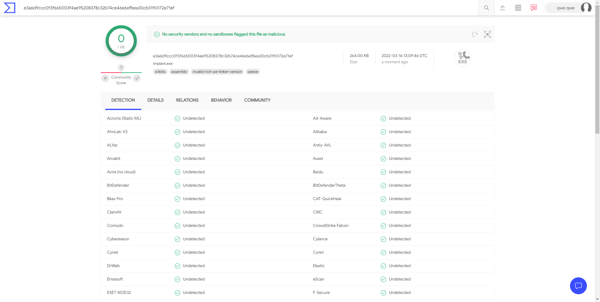

# baby-C2

I built a C2 by following the guide in  [Introduction - Building C2 Implants in C++: A Primer (gitbook.io)](https://shogunlab.gitbook.io/building-c2-implants-in-cpp-a-primer/)

Including a server(Flask and MongoDB ) , a client, and a C2 (C++17)

Known bugs: 

~~Error would be thrown if the results have any chinese charactor.~~ (<nlohmann/json.hpp> can't read GBK , convert json contents from GBK to UTF-8 can fix it)


## How to use

run server.py(MongoDB required) , and run Implant.

Then run command in client:

```python
python client.py add-tasks --tasktype execute --options command="ipconfig"
```


VirusTotal for fun :)

